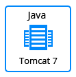

## Nexus Repository Manager

The JPS package deploys [Nexus Repository Manager](http://www.sonatype.org/) that initially contains 1 application server. 

### Highlights
This package is designed to deploy Nexus Repository Manager environment, a free repository manager with universal support for popular component formats:  

  -  Basic component intelligence
  -  Supports Maven, Docker, NuGet, npm, PyPI, Bower, and more 
  
Nexus Repository Manager sets the standard for repository management providing development teams with the ability to proxy remote repositories and share software artifacts.

### Environment Topology

### Specifics

Layer                |     Server    | Number of CTs   by default | Cloudlets per CT   (reserved/dynamic) | Options
-------------------- | --------------| :----------------------------: | :---------------------------------------: | :-----:
AS                   | NGINX PHP |       1                        |           1 / 32                          | -

* AS - Application server 
* CT - Container

**Nexus Repository Manager**: OSS 3.30.1-01 
**NGINX Version**: 1.18.0 
**PHP Engine Version**: 8 

### Deployment

In order to get this solution instantly deployed, click the "DEPLOY TO JELASTIC" button, specify your email address within the widget, choose one of the [Jelastic Public Cloud providers](https://jelastic.cloud) and press Install.

To deploy this package to Jelastic Private Cloud, import [this JPS manifest](../../raw/master/manifest.jps) within your dashboard ([detailed instruction](https://docs.jelastic.com/environment-export-import#import)).

More information about Jelastic JPS package and about installation widget for your website can be found in the [Jelastic JPS Application Package](https://github.com/jelastic-jps/jpswiki/wiki/Jelastic-JPS-Application-Package) reference.
